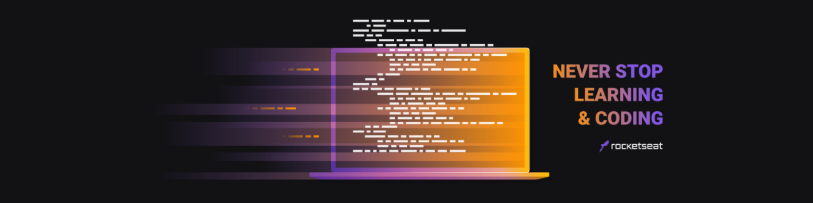

# Maratona Discover :space_invader:
Programação na prática 
<h1 align="center">
    
</h1>

## 🚀 Tecnologias

Esse projeto foi desenvolvido com as seguintes tecnologias:

- [HTML]
- [CSS]
- [JavaScript]
 
 ## 💻 Projeto

Nesse evento da rocketseat foi nos apresentado conceitos basicos de HTML, CSS e Javascript, e eu decidi levar eles pro *proximo nivel* 💜

Este é um projeto desenvolvido durante a **[Maratona Discover](https://maratonadiscover.rocketseat.com.br/)**, realizada pela **[@Rocketseat](https://github.com/Rocketseat)** durante os dias 14/01 de Janeiro de 2021 a 04/02 de Fevereiro de 2021.

---
Desenvolvido com ❤️ by 💥 Renan Afrausino
